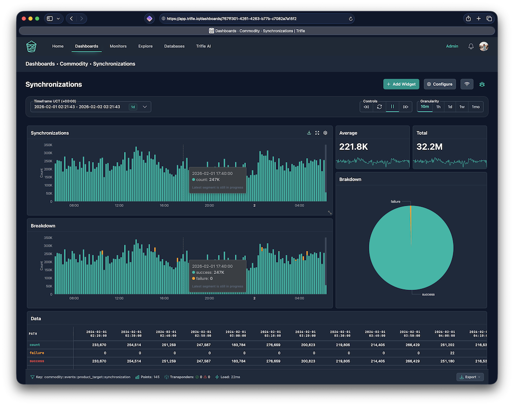

# Trifle App

Dashboards, alerts, and scheduled reports for your time-series metrics. Connect your existing database or push data via API — then visualize, monitor, and share insights with your team. Cloud hosted at [app.trifle.io](https://app.trifle.io) or self-hosted on your own infrastructure.

Part of the [Trifle](https://trifle.io) ecosystem.



## Features

- **Real-time dashboards** — Phoenix LiveView-powered analytics with Apache ECharts visualizations
- **Metrics API** — Push data via REST API with Bearer token authentication
- **Monitors & alerts** — Scheduled checks with email, Slack, and Discord delivery
- **AI-powered chat** — Conversational analytics assistant (OpenAI GPT integration)
- **Multiple data sources** — Project sources (read/write via API) and database sources (read-only from your DB)
- **Self-hosted or cloud** — Deploy on Kubernetes, Docker Compose, or use the hosted version
- **Dark mode** — Full dark mode support across all components

## Quick Start (Docker Compose)

```bash
# Create local env
echo "TRIFLE_DB_ENCRYPTION_KEY=$(openssl rand -base64 32)" >> .env.local

# Start PostgreSQL, MongoDB, and the application
docker compose up -d

# Inside the app container: install deps, setup DB, start server
docker compose exec -T app mix deps.get
docker compose exec -T app mix deps.compile
docker compose exec -T app mix ecto.create
docker compose exec -T app mix ecto.migrate
docker compose exec -T app mix run priv/repo/seeds.exs
docker compose exec -T app mix phx.server
```

Visit [http://localhost:4000](http://localhost:4000).

## Architecture

| Layer | Technology | Purpose |
|-------|-----------|---------|
| **Web** | Phoenix LiveView | Real-time dashboards and UI |
| **Metrics storage** | MongoDB (via trifle_stats) | Time-series data with automatic aggregation |
| **Application data** | PostgreSQL | Users, projects, tokens, organizations |
| **Background jobs** | Oban | Monitor scheduling, report delivery |
| **Charts** | Apache ECharts | Time-series and stacked visualizations |
| **Styling** | TailwindCSS + Alpine.js | UI components and interactions |

## API

Push metrics with a project token:

```bash
curl -X POST "http://localhost:4000/api/v1/metrics" \
  -H "Content-Type: application/json" \
  -H "Authorization: Bearer YOUR_TOKEN" \
  -d '{
    "key": "page_views",
    "at": "2026-02-16T10:30:00Z",
    "values": {
      "total": 1250,
      "unique": 890,
      "pages": { "home": 650, "dashboard": 400 }
    }
  }'
```

## Delivery Channels

- **Email** — Configure `Trifle.Mailer` (see `EMAILS.md`). All organization members are available as delivery targets.
- **Slack** — Set `SLACK_CLIENT_ID`, `SLACK_CLIENT_SECRET`, `SLACK_SIGNING_SECRET`, and `SLACK_REDIRECT_URI`. Authorize workspaces from **Organization > Delivery**.
- **Discord** — Set `DISCORD_CLIENT_ID`, `DISCORD_CLIENT_SECRET`, `DISCORD_BOT_TOKEN`, and `DISCORD_REDIRECT_URI`. Connect servers from **Organization > Delivery**.

## ChatLive Assistant

Conversational analytics assistant that queries your metrics using OpenAI GPT models. Available at `/chat`.

| Variable | Purpose | Default |
|----------|---------|---------|
| `OPENAI_API_KEY` | Required — OpenAI API token | — |
| `OPENAI_MODEL` | Optional — model override | `gpt-5` |

## Deployment

### Docker Images

Automated builds via GitHub Actions on every push to `main` and version tags:
- `trifle/app` — Application image (AMD64 + ARM64)
- `trifle/environment` — Base image (Ruby, Erlang, Elixir)

Version is defined in the root `VERSION` file.

### Kubernetes (Helm)

```bash
helm install trifle .devops/kubernetes/helm/trifle \
  --set app.secretKeyBase="$(openssl rand -base64 48)" \
  --set postgresql.auth.password="$(openssl rand -base64 32)" \
  --set initialUser.email="admin@example.com"
```

Self-hosted mode is enabled by default (`app.deploymentMode=self_hosted`). Override with `--set app.deploymentMode=saas` for multi-tenant.

### Docker Compose (Production)

```bash
cd .devops/docker/production
cp .env.example .env
# Edit .env with your production values
docker-compose up -d
```

### Email Delivery

Configurable via Helm. Supported adapters: `local` (default), `smtp`, `postmark`, `sendgrid`, `mailgun`, `brevo`.

```yaml
app:
  mailer:
    adapter: "smtp"
    from:
      name: "Trifle"
      email: "no-reply@example.com"
    smtp:
      relay: "smtp.example.com"
      username: "smtp-user"
      password: "smtp-pass"
      port: 587
```

### Monitoring

- **Honeybadger** — Set `app.honeybadger.apiKey` in Helm values
- **AppSignal** — Set `app.appsignal.enabled: true` with `pushApiKey`

## Background Jobs & Monitors

Monitor schedules are orchestrated by `Trifle.Monitors.Jobs.DispatchRunner`, which runs every minute and enqueues jobs on the `reports` and `alerts` queues via Oban.

Oban Web UI is optional: set `OBAN_WEB_LICENSE_KEY` before `mix deps.get` to enable the dashboard at `/admin/oban`.

## Development

### Prerequisites

- Elixir 1.18.4
- Phoenix Framework
- PostgreSQL + MongoDB (or use Docker Compose)

### Test Data

```bash
# Quick API validation (4 sample metrics)
./test_metrics.sh YOUR_TOKEN

# Bulk population (recommended for large datasets)
./populate_batch.sh YOUR_TOKEN 500 72   # 500 metrics over 3 days

# Mix task (small datasets)
mix populate_metrics --token=YOUR_TOKEN --count=100 --hours=24
```

## Documentation

Full guides at **[docs.trifle.io/trifle-app](https://docs.trifle.io/trifle-app)**

## Trifle Ecosystem

| Component | What it does |
|-----------|-------------|
| **[Trifle CLI](https://github.com/trifle-io/trifle-cli)** | Query and push metrics from the terminal. MCP server mode for AI agents. |
| **[Trifle::Stats (Ruby)](https://github.com/trifle-io/trifle-stats)** | Time-series metrics library for Ruby. |
| **[Trifle.Stats (Elixir)](https://github.com/trifle-io/trifle_stats)** | Time-series metrics library for Elixir. |
| **[Trifle Stats (Go)](https://github.com/trifle-io/trifle_stats_go)** | Time-series metrics library for Go. |
| **[Trifle::Traces](https://github.com/trifle-io/trifle-traces)** | Structured execution tracing for background jobs. |
| **[Trifle::Logs](https://github.com/trifle-io/trifle-logs)** | File-based log storage with ripgrep-powered search. |
| **[Trifle::Docs](https://github.com/trifle-io/trifle-docs)** | Map a folder of Markdown files to documentation URLs. |

## License

Available under the [Elastic License 2.0](https://www.elastic.co/licensing/elastic-license). See [LICENSE](LICENSE) for details.
