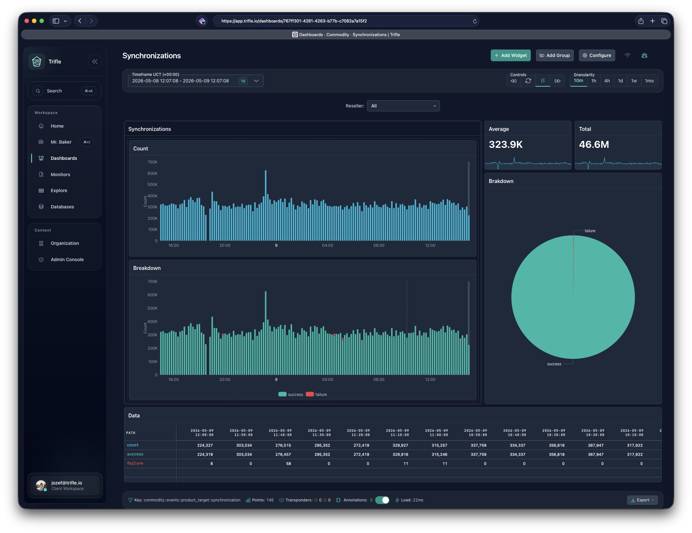

# Trifle App

Dashboards, alerts, and scheduled reports for your time-series metrics. Connect the database where you already track metrics with [Trifle Stats](https://github.com/trifle-io/trifle-stats), then visualize, monitor, and share insights with your team.

Part of the [Trifle](https://trifle.io) ecosystem.



## Features

- **Real-time dashboards.** Phoenix LiveView-powered analytics with Apache ECharts visualizations.
- **Metrics API.** Read metrics, manage dashboards and alerts programmatically via REST API.
- **Monitors & alerts.** Scheduled checks with email, Slack, and Discord delivery.
- **AI-powered chat.** Conversational analytics assistant (OpenAI GPT integration).
- **Connect your database.** Read metrics directly from your existing Postgres, MongoDB, Redis, MySQL, or SQLite where you track with Trifle Stats.
- **Self-hosted.** Deploy on Kubernetes or Docker Compose on your own infrastructure.
- **Dark mode.** Full dark mode support across all components.

## Quick Start (Docker Compose)

```bash
# Create local env
echo "TRIFLE_DB_ENCRYPTION_KEY=$(openssl rand -base64 32)" >> .env.local

# Start PostgreSQL and the application
docker compose up -d

# Inside the app container: install deps, setup DB, start server
docker compose exec -T app mix deps.get
docker compose exec -T app mix deps.compile
docker compose exec -T app mix ecto.create
docker compose exec -T app mix ecto.migrate
docker compose exec -T app mix run priv/repo/seeds.exs
docker compose exec -T app mix phx.server
```

Visit [http://localhost:4000](http://localhost:4000).

## Architecture

| Layer | Technology | Purpose |
|-------|-----------|---------|
| **Web** | Phoenix LiveView | Real-time dashboards and UI |
| **Application data** | PostgreSQL | Users, organizations, dashboards, monitors |
| **Your metrics database** | Postgres, MongoDB, Redis, MySQL, SQLite | Time-series data tracked with Trifle Stats |
| **Background jobs** | Oban | Monitor scheduling, report delivery |
| **Charts** | Apache ECharts | Time-series and stacked visualizations |
| **Styling** | TailwindCSS + Alpine.js | UI components and interactions |

## Delivery Channels

- **Email.** Configure `Trifle.Mailer` (see `EMAILS.md`). All organization members are available as delivery targets.
- **Slack.** Set `SLACK_CLIENT_ID`, `SLACK_CLIENT_SECRET`, `SLACK_SIGNING_SECRET`, and `SLACK_REDIRECT_URI`. Authorize workspaces from **Organization > Delivery**.
- **Discord.** Set `DISCORD_CLIENT_ID`, `DISCORD_CLIENT_SECRET`, `DISCORD_BOT_TOKEN`, and `DISCORD_REDIRECT_URI`. Connect servers from **Organization > Delivery**.

## ChatLive Assistant

Conversational analytics assistant that queries your metrics using OpenAI GPT models. Available at `/chat`.

| Variable | Purpose | Default |
|----------|---------|---------|
| `OPENAI_API_KEY` | Required. OpenAI API token. | |
| `OPENAI_MODEL` | Optional. Model override. | `gpt-5` |

## Deployment

### Docker Images

Automated builds via GitHub Actions on every push to `main` and version tags:
- `trifle/app`: Application image (AMD64 + ARM64)
- `trifle/environment`: Base image (Ruby, Erlang, Elixir)
- `trifle/network-gateway`: Shared Tailscale network gateway (AMD64 + ARM64)

Version is defined in the root `VERSION` file.

### Kubernetes (Helm)

```bash
helm install trifle .devops/kubernetes/helm/trifle \
  --set app.secretKeyBase="$(openssl rand -base64 48)" \
  --set postgresql.auth.password="$(openssl rand -base64 32)" \
  --set initialUser.email="admin@example.com"
```

### Docker Compose (Production)

```bash
cd .devops/docker/production
cp .env.example .env
# Edit .env with your production values
docker-compose up -d
```

### Email Delivery

Configurable via Helm. Supported adapters: `local` (default), `smtp`, `postmark`, `sendgrid`, `mailgun`, `brevo`.

```yaml
app:
  mailer:
    adapter: "smtp"
    from:
      name: "Trifle"
      email: "no-reply@example.com"
    smtp:
      relay: "smtp.example.com"
      username: "smtp-user"
      password: "smtp-pass"
      port: 587
```

### Monitoring

- **Honeybadger.** Set `app.honeybadger.apiKey` in Helm values.
- **AppSignal.** Set `app.appsignal.enabled: true` with `pushApiKey`.

## Background Jobs & Monitors

Monitor schedules are orchestrated by `Trifle.Monitors.Jobs.DispatchRunner`, which runs every minute and enqueues jobs on the `reports` and `alerts` queues via Oban.

Oban Web UI is optional: set `OBAN_WEB_LICENSE_KEY` before `mix deps.get` to enable the dashboard at `/admin/oban`.

## Development

### Prerequisites

- Elixir 1.18.4
- Phoenix Framework
- PostgreSQL (or use Docker Compose)

### Test Data

```bash
# Quick API validation (4 sample metrics)
./test_metrics.sh YOUR_TOKEN

# Bulk population (recommended for large datasets)
./populate_batch.sh YOUR_TOKEN 500 72   # 500 metrics over 3 days

# Mix task (small datasets)
mix populate_metrics --token=YOUR_TOKEN --count=100 --hours=24
```

## Documentation

Full guides at **[docs.trifle.io/trifle-app](https://docs.trifle.io/trifle-app)**

## Trifle Ecosystem

| Component | What it does |
|-----------|-------------|
| **[Trifle CLI](https://github.com/trifle-io/trifle-cli)** | Query and push metrics from the terminal. MCP server mode for AI agents. |
| **[Trifle::Stats (Ruby)](https://github.com/trifle-io/trifle-stats)** | Time-series metrics library for Ruby. |
| **[Trifle.Stats (Elixir)](https://github.com/trifle-io/trifle_stats)** | Time-series metrics library for Elixir. |
| **[Trifle Stats (Go)](https://github.com/trifle-io/trifle_stats_go)** | Time-series metrics library for Go. |
| **[Trifle::Traces](https://github.com/trifle-io/trifle-traces)** | Structured execution tracing for background jobs. |
| **[Trifle::Logs](https://github.com/trifle-io/trifle-logs)** | File-based log storage with ripgrep-powered search. |
| **[Trifle::Docs](https://github.com/trifle-io/trifle-docs)** | Map a folder of Markdown files to documentation URLs. |

## License

Available under the [Elastic License 2.0](https://www.elastic.co/licensing/elastic-license). See [LICENSE](LICENSE) for details.

## Internal job metrics

Internal observability is enabled by default and controls the app's own Oban traces
and their Trifle.Stats metrics together. In development, configure it in `.env`
(or override it in `.env.local`):

```dotenv
TRIFLE_OBSERVABILITY_ENABLED=true
TRIFLE_OBSERVABILITY_GRANULARITIES=1m,1h,1d,1mo
TRIFLE_OBSERVABILITY_DEFAULT_TIMEFRAME=6h
TRIFLE_OBSERVABILITY_DEFAULT_GRANULARITY=1m
TRIFLE_OBSERVABILITY_TIME_ZONE=UTC
```

Set it to `false` to disable internal telemetry, then restart the app process.
Development Compose already loads these env files; the test environment always
disables internal telemetry, even if `.env` enables it.

For production Helm deployments, use:

```yaml
app:
  observability:
    enabled: false
    granularities: ["1m", "1h", "1d", "1mo"]
    defaultTimeframe: "6h"
    defaultGranularity: "1m"
    timeZone: "UTC"
```

This maps to `TRIFLE_OBSERVABILITY_ENABLED` in the app and release hook jobs.
An explicit `app.env.TRIFLE_OBSERVABILITY_ENABLED` overrides the structured value.
Non-Helm deployments use the same environment variable; production Docker Compose
also forwards it from its `.env`. Apply the deployment change to restart the app.

Disabling skips internal storage initialization, Oban tracing, trace metrics, and
new internal source provisioning. It does not delete existing data or sources,
disable ordinary application logging, or affect user-configured Stats/Traces sources
and their retention cleanup. Existing S3 lifecycle rules still apply. Payload
storage remains configurable through `TRIFLE_TRACES_*` / Helm `app.traces` settings.
Internal metrics and their generated source use UTC by default; configure both with
`TRIFLE_OBSERVABILITY_TIME_ZONE` or Helm `app.observability.timeZone`.

The internal observability source records Oban metrics as `jobs::JOB_NAME`, for example `jobs::Trifle.Monitors.Jobs.DispatchRunner`. Worker dots remain literal in the metric key. The payload contains `count`, `states.<state>`, and `entries.count`; trace keys are `jobs/JOB_NAME`, with no additional namespace prefix. Existing metrics and saved dashboard/monitor selections are not migrated automatically.

## Testing coordinated Stats changes

The default Git dependency is locked to the pushed escaped-path implementation in
`trifle_stats` (`3a8a913aed720020e4df9038e7ebbdbf7b5df47f`). No Hex release is required
to test this integration:

```sh
docker compose exec -T -e MIX_ENV=test app env -u TRIFLE_STATS_PATH mix test
```

For development and tests only, `TRIFLE_STATS_PATH` can select a local Stats checkout without changing that lock:

```sh
docker compose exec -T -e MIX_ENV=test -e TRIFLE_STATS_PATH=/workspaces/trifle_stats app mix test
```

Upgrade all readers and writers sharing storage together. Releases and deployment remain user-controlled; see `docs/escaped_paths_plan.md` for the coordinated handoff.
